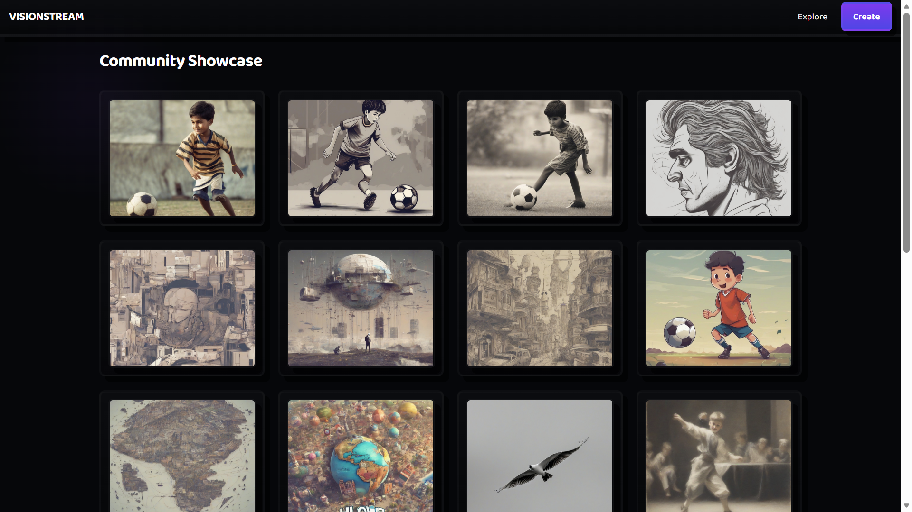
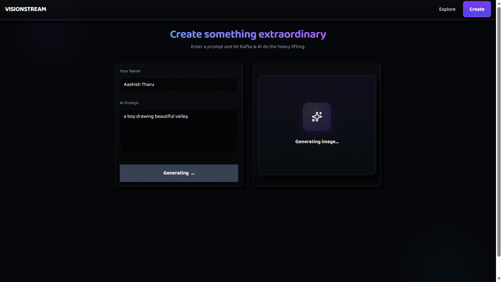
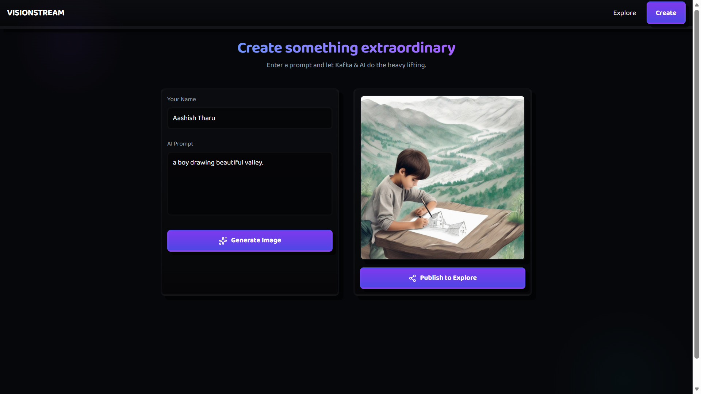

# VisionStream-AI

VisionStream-AI is a full-stack, event-driven AI image generation application. Instead of standard synchronous API calls, this project utilizes **Apache Kafka** to decouple the client requests from the heavy AI inference workloads, ensuring high availability and zero dropped requests even under heavy traffic.

## Features

* **Asynchronous Image Generation:** Uses Kafka as a message broker to queue prompts, preventing server timeouts during long AI generation times.
* **Hugging Face Integration:** Leverages state-of-the-art Stable Diffusion models via the official `@huggingface/inference` library.
* **Cloud Asset Management:** Automatically uploads generated image buffers to **Cloudinary** for optimized global delivery.
* **Persistent Gallery:** Stores image metadata, authors, and prompts securely in **MongoDB**.
* **Modern UI:** Built with React for a seamless, interactive user experience.

## System Architecture

This project is built using a Producer/Consumer pattern:
1. **The Client (React):** Sends a prompt to the Express server.
2. **The Producer (Express):** Instantly returns a `Job ID` to the user and publishes the prompt to a Kafka topic (`image_requests`).
3. **The Message Broker (Aiven Kafka):** Securely holds the job in the cloud.
4. **The Consumer (Node.js Worker):** Listens to Kafka, picks up the prompt, and queries the Hugging Face AI.
5. **The Storage Pipeline:** The worker takes the AI-generated raw buffer, uploads it to Cloudinary for a public URL, and saves the final record to MongoDB.

## Tech Stack

* **Frontend:** React.js, Vite
* **Backend:** Node.js, Express.js, TypeScript
* **Message Broker:** Apache Kafka (hosted on Aiven Cloud)
* **AI Provider:** Hugging Face Inference API
* **Database:** MongoDB Atlas (Mongoose)
* **Image Storage:** Cloudinary

---

## App Screenshots

### The Dashboard

### The Generation Process (Loading Animation)

### The Final Result

## Getting Started

### Prerequisites
Make sure you have the following installed/setup:
* Node.js (v18+)
* Aiven Cloud Account (for Kafka credentials)
* Hugging Face Account (Read Access Token)
* Cloudinary Account
* MongoDB Atlas Cluster

### Installation

1. **Clone the repository**
   git clone https://github.com/aashish-tharu/visionstream-ai.git  
   cd visionstream-ai  

2. **Install Backend Dependencies**
   cd server  
   npm install  

3. **Install Frontend Dependencies**
   cd ../client  
   npm install  

### Environment Variables

Create a `.env` file in the `server` directory and add the following:

# Server
PORT=5000

# Database
MONGODB_URI=your_mongodb_atlas_connection_string

# Kafka (Aiven)
KAFKA_BROKER=your_aiven_broker_url:port  
KAFKA_CA_PATH=./certs/ca.pem  
KAFKA_CERT_PATH=./certs/service.cert  
KAFKA_KEY_PATH=./certs/service.key  

# AI Provider
HUGGINGFACE_API_KEY=your_hugging_face_read_token

# Cloudinary
CLOUDINARY_CLOUD_NAME=your_cloud_name  
CLOUDINARY_API_KEY=your_api_key  
CLOUDINARY_API_SECRET=your_api_secret  

*(Note: Ensure you place your Aiven SSL certificate files inside a `server/certs` folder and do not commit them to Git).*

### Running the Application

**1. Start the Backend & Kafka Worker:**
cd server  
npm run dev  

**2. Start the Frontend:**
cd client  
npm run dev  

## What I Learned
Building this project taught me how to handle long-running background tasks in a Node.js environment. By moving away from basic REST endpoints to an event-driven architecture using Kafka, I learned how enterprise systems scale and handle asynchronous workloads safely.

---
*Designed and built by [Aashish Tharu]*